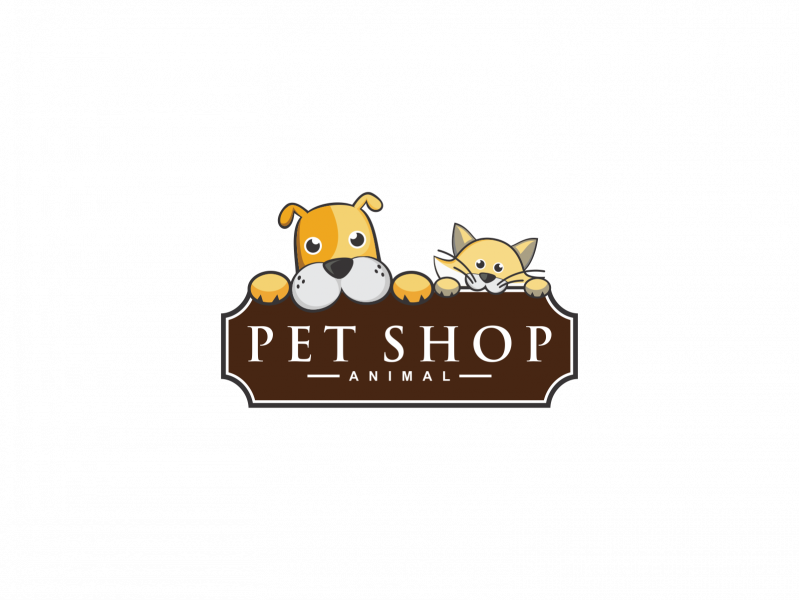

# PetRego Technical Challenge

This project is a response to a technical challenge. It is by no means a production system, however is intended as a demonstration of my ability to respond to a specific brief and stretch my technical capabilities within a limited timeframe.

## The Brief

Your client PetRego is looking to build a new service presenting a REST API that will allow it to maintain a list of owners, their pets, and attributes.

They want to record such details as:

- The owner's name
- The pet's name
- The type of animal (we particularly care about dogs, cats, chickens and snakes).

The most common request will be to look up the pets that belong to a person.

Months later after the success of PetRego's new service they have set up a partnership with a local pet food supplier that wants to use this information to start determining the food orders owners will need to make. In the time between release of Version 1 of your API and now, several third parties have built their own applications on top your API. PetRego does not want to break existing compatibility while introducing this new functionality.

We know that:

- Dogs eat bones
- Cats eat fish
- Chickens eat corn
- Snakes eat mice

Assessment Criteria:

- Build a simple rest service for storage and retrieval of owner and pet details. Your API should be:
  - RESTful.
  - Return (at least) JSON responses.
  - Unauthenticated (though if you have thoughts on that you can put it in comments).
- Your solution should be provided as a git repository. Please demonstrate regular commits and good git practices.
- Include a README with documentation around API endpoints and response format.
- Include in your README the commands for building and running your solution and the port it starts on.

Things we will be looking for:

- Data modelling and API design.
- Style:
  - Clarity
  - Commenting where appropriate
  - Consistency
- Testing.

Things that you should consider implementing in your solution:

- Versioned API
- Dependency Injection
- Mocking
- HATEOAS/Hypermedia Principles

Some notes:

- We realize that projects like this are never quite finished. We're not looking to take your assessment and put it into production.

- Take the time to demonstrate understanding of concepts; comments and TODOs are a great way to indicate what could be achieved in future for areas where the time/benefit trade off is not worth it.

- Don't over engineer the solution. Conversely, if there's a great tool that can auto-generate this entire solution from a YAML file, that's not showing us you understand the principles at work. For the sake of the assessment, you're welcome to use external dependencies, but don't go overboard.

## The Approach

Todo.

### Technologies Used

Todo.

### Architecture

Todo.

## Setup

Todo.

## Usage

Todo.

## Future Improvements

Todo.

## References & Inspiration

Todo.