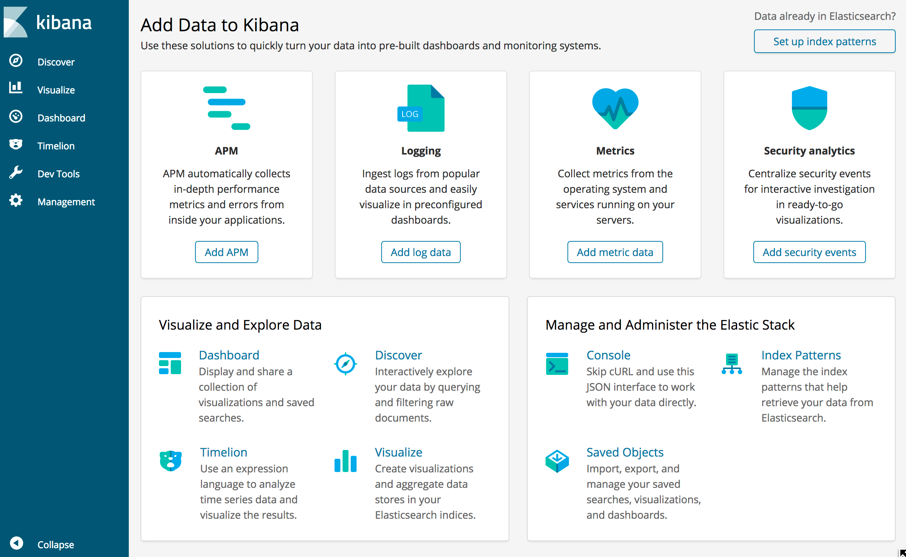
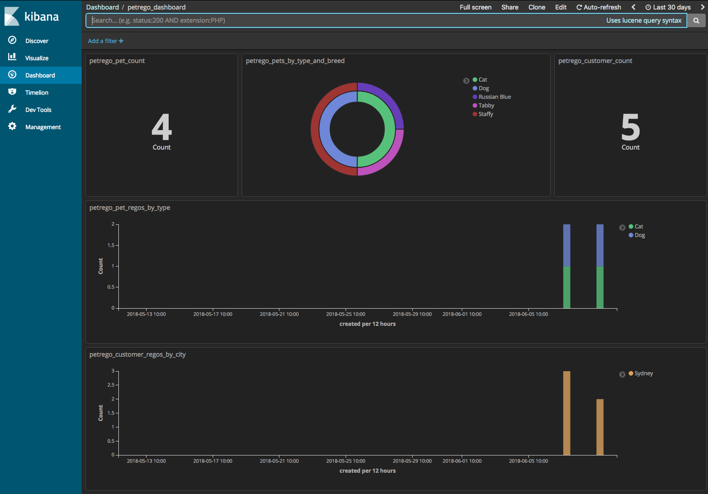
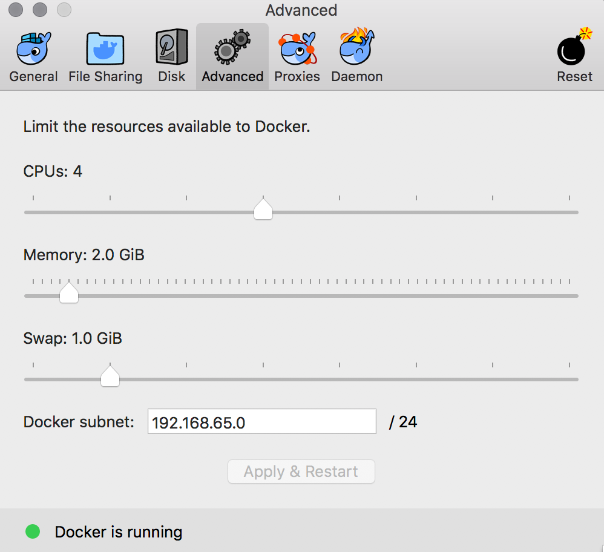
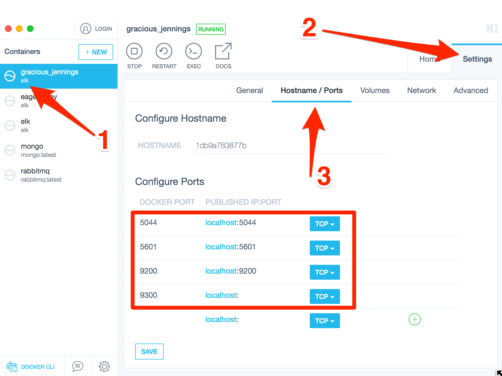

# PetRego Technical Challenge


This project is a response to a technical challenge. It is by no means a production system, however is intended as a demonstration of my ability to respond to a specific brief and stretch my technical capabilities within a limited time-frame.


# The Brief

Your client PetRego is looking to build a new service presenting a REST API that will allow it to maintain a list of owners, their pets, and attributes.

## They want to record such details as:

- The owner's name
- The pet's name
- The type of animal (we particularly care about dogs, cats, chickens and snakes).

The most common request will be to look up the pets that belong to a person.

Months later after the success of PetRego's new service they have set up a partnership with a local pet food supplier that wants to use this information to start determining the food orders owners will need to make. In the time between release of Version 1 of your API and now, several third parties have built their own applications on top your API. PetRego does not want to break existing compatibility while introducing this new functionality.

We know that:

- Dogs eat bones
- Cats eat fish
- Chickens eat corn
- Snakes eat mice

## Assessment Criteria:

- Build a simple rest service for storage and retrieval of owner and pet details. Your API should be:
  - RESTful.
  - Return (at least) JSON responses.
  - Unauthenticated (though if you have thoughts on that you can put it in comments).
- Your solution should be provided as a git repository. Please demonstrate regular commits and good git practices.
- Include a README with documentation around API endpoints and response format.
- Include in your README the commands for building and running your solution and the port it starts on.

## Things we will be looking for:

- Data modelling and API design.
- Style:
  - Clarity
  - Commenting where appropriate
  - Consistency
- Testing.

## Things that you should consider implementing in your solution:

- Versioned API
- Dependency Injection
- Mocking
- HATEOAS/Hypermedia Principles

## Some notes:

- We realize that projects like this are never quite finished. We're not looking to take your assessment and put it into production.

- Take the time to demonstrate understanding of concepts; comments and TODOs are a great way to indicate what could be achieved in future for areas where the time/benefit trade off is not worth it.

- Don't over engineer the solution. Conversely, if there's a great tool that can auto-generate this entire solution from a YAML file, that's not showing us you understand the principles at work. For the sake of the assessment, you're welcome to use external dependencies, but don't go overboard.


# The Approach

- I chose to build a WebAPI project using DotNetCore. This was purely to learn the framework as I believe it is a strongly emerging technology for good reasons.
- I developed this on MacOS with VisualStudio 2017 Community Edition. No ReSharper or linting addons, just coding bare-back...I really miss ReSharper!
- The solution is not complete or production-ready by any means, but I have commented and marked todo items to indicate this and added a section below on future improvements.

## Documentation

For this I added Swashbuckle to the app host. Swashbuckle comprises three packages – a Swagger generator, middleware to expose the generated Swagger as JSON endpoints and middleware to expose a Swagger UI that’s powered by these endpoints. It does a nice job of inspecting your API structure and presents a nice UI. See the Usage section below for details.

## Data Layer
I originally considered using a relational database, possibly Microsoft SQL Server. Together with a mature ORM such as Entity Framework this would work nicely with WebApi. I chose however to take a challenge and use a completely different approach, implementing Elastic Search using the NEST SDK. 

I did this for the following advantages;

- :green_heart: To try something different.
- :green_heart: To challenge myself and further my knowledge of the technology.
- :green_heart: To simplify setup - simply using a pre-compiled Docker image of an entire ELK stack.
- :green_heart: To leverage data visualization tools that come out of the box with Kibana.

...however with the following disadvantages...

- :broken_heart: Added time and complexity to deliver the solution.
- :broken_heart: Repository code is not as succinct and elegant compared to coding against Entity Framework contexts.
- :broken_heart: Does not smoothly integrate with WebApi.
- :broken_heart: Harder to test, some testing has been left as a todo item (not happy about this at all).

## API Versioning

There is a ridiculous level of contention surrounding the subject of how versioning should be approached when building a "RESTful" API. Above all the philosophical and semantic rants, an API in the real world will always need to change to meet the demands of it's consumers - and sometimes this will be a breaking change. This should be managed by a change strategy, a set of rules and process for handling changes. One such set of rules might be;
- All new stuff is optional
- Don't remove stuff
- Don't change the way stuff is processed
- Don't change things that were optional to be required

Some rules around what versioning can be applied to might be;
- The data/document itself
- The message format
- The server or actual API implementation
- The client

Generally it seems that API versioning is approached by applying a versioning strategy, often along with a change strategy. Versioning is often an implementation specific approach possibly with some rules, with a change strategy involving also a set of rules and operational processes. I believe this is a salient approach and often works pragmatically, however I question the implementation-specific details. A set of general rules I feel is appropriate for a versioning strategy is;

- The prime goal of versioning is to support breaking changes whilst maintaining existing contracts with your consumers. 
- Clients should not have to upgrade to new versions, it should always be optional.
- Versioning may also be used for experimental features that may even be short-lived.
- Versioning should be clear and self-document, it should not be a Rube Goldberg machine.
- Versioning should not require your clients to implement custom config/code in order to use it. 
- The API should tell your clients when there are versions available.

...however just about every RESTful API I have worked on has applied one of the following implementations; 

#### Modifying URL structure
```
HTTP GET:
https://localhost/api/v1/owner/12345
https://localhost/api/v2/owner/12345
```

#### Query String Param
```
HTTP GET:
https://localhost/api/owner/12345?version=1
https://localhost/api/owner/12345?version=2
```

Whilst all of these tend to work in the pragmatic fast-paced and resource-poor world we all work in, I often see the code become a mess of multi-layered and somewhat duplicated versions of services, namespaces, folder structures and it ends being costly and a pain to maintain. 

More importantly - these directly break [constraints defined](https://www.ics.uci.edu/~fielding/pubs/dissertation/rest_arch_style.htm) in the REST architecture and have been [covered off in numerous articles](https://www.infoq.com/articles/roy-fielding-on-versioning/) by the original creator, for the following reasons;
- The URL is the location of a resource, not the version of the response data you want from that resource.
- The available versions are not discoverable by a client.
- It isn't clear which version a client should be using or which is the default.
- Control params may get mixed up with application params.

So whilst these are perfectly acceptable ways to version an API, they should not be used to version a REST API. Using one of the methods below and providing versions of docs/data where available in the response hypermedia is considered RESTful. 

#### Custom Header
```
HTTP GET:
https://localhost/api/owner/12345
version: 1

HTTP GET:
https://localhost/api/owner/12345
version: 2
```

#### Custom ACCEPT/CONTENT-TYPE Header
```
HTTP GET:
https://localhost/api/owner/12345
Accept: application/vnd.api.owner+json; version=1

HTTP GET:
https://localhost/api/owner/12345
Accept: application/vnd.api.owner+json; version=2
```

#### Enhanced Media Type Header
```
HTTP GET:
https://localhost/api/owner/12345
Accept: application/vnd.api.owner.v1+json

HTTP GET:
https://localhost/api/owner/12345
Accept: application/vnd.api.owner.v2+json
```

## Hypermedia

The concept of hypermedia was born over 80 years ago, it's surprising that with the popularity of REST that still the vast majority of RESTful APIs do not adhere to the basic constraints/principals, such as hypermedia (HATEOAS).

An API must be using hypermedia to transfer state and describe itself to a client in order to be considered RESTful, yet it seems this fundamental fact is lost in translation. Most people I ask about what makes an API RESTful still respond by talking about URL structure and HTTP verbs, there is still much we have to learn about the topic it seems (myself included)!

## Architecture

todo...
- show how the application tiering is constructed
- show some of the hypermedia flows
- show physical architecture relationship between client/api host/database

## Assumptions

- An assumption was made that Pet can only have a single Owner assignment. I did this for simplicity more than anything else but the solution could be easily modified to support Pets having multiple Owner assignments.
- An assumption was made that it is safe for error/exception detail to be returned to failed API calls. In most production scenarios, it is often wise to abstract this detail and provide a standardized set of error codes which can be referenced via API documentation. This is often done sue to the high chance of inadvertently exposing personally identifiable information (PII) or other sensitive data via exceptions/stack traces etc.

# Setup


This [guide from Microsoft](https://www.microsoft.com/net/learn/get-started/macos) shows how to get DotNetCore running on a clean machine in 10mins.

## Dependencies

- Visual Studio 2017 [(setup guide)](https://docs.microsoft.com/en-us/visualstudio/install/install-visual-studio)
- DotNetCore [(setup guide)](https://www.microsoft.com/net/download/macos)
- Docker [(setup for MacOS)](https://docs.docker.com/docker-for-mac/install/) [(setup for Windows)](https://docs.docker.com/docker-for-windows/install/)
- Postman [(setup guide)](https://www.getpostman.com/) (optional but recommended).
- ElasticSearch [docs](http://elk-docker.readthedocs.io/) and [(docker hub)](https://hub.docker.com/r/sebp/elk/)

# Running

## Backend - ELK Container

After installing and running the Docker daemon with all defaults, pull down the ELK container as follows...

```text
docker pull sebp/elk
```

This container comes as a pre-compiled image which is ready to run. It is quite a complex image containing multiple components hosted on multiple ports making up an entire ELK stack (**E**lasticsearch + **L**ogstash + **K**ibana). The ports and components are as follows...

- 5601 - This is the Kibana web interface.
- 9200 - This is the ElasticSearch API endpoint.
- 5044 - This is for Logstash Beats interface, which is basically a forward endpoint for ElasticSearch plugins called 'Beats'. This is a pretty cool extension to ElasticSearch if you want to [look it up.](https://www.elastic.co/products/beats)

To run the container with all it's components simply type the following in a shell(Bash/Powershell)...

```bash
docker run -p 5601:5601 -p 9200:9200 -p 5044:5044 -it sebp/elk
```

If you want to name your container simply provide the optional '--name' arg as shown below, otherwise Docker will create a silly random name for you...

```bash
docker run -p 5601:5601 -p 9200:9200 -p 5044:5044 -it --name my-elk-stack sebp/elk
```

When you run this, you should see a heap of logs output to the shell and hopefully no errors! A common error is when the Docker daemon has not been assigned sufficient memory (see Troubleshooting section below).

If all goes well you should now be able to hit the ElasticSearch API endpoint...

```bash
http://localhost:9200/
```

Which should respond with some JSON that looks like...

```json
{
  "name" : "ohfrbLd",
  "cluster_name" : "elasticsearch",
  "cluster_uuid" : "mKJtcGI9Sc-IIlHClg74dg",
  "version" : {
    "number" : "6.2.4",
    "build_hash" : "ccec39f",
    "build_date" : "2018-04-12T20:37:28.497551Z",
    "build_snapshot" : false,
    "lucene_version" : "7.2.1",
    "minimum_wire_compatibility_version" : "5.6.0",
    "minimum_index_compatibility_version" : "5.0.0"
  },
  "tagline" : "You Know, for Search"
}
```

Then you should be able to open the Kibana web interface...

```bash
http://localhost:5601/app/kibana
```

Which should show a page that looks something like...



:sunglasses: If you got this far without issues - congrats and please proceed!

:rage: If you had issues getting this working, the API will just return 500 responses and nothing will work - so please see the Troubleshooting section below before proceeding.

## API - DotNetCore

The solution will self-host using Kestral (light-weight web server bundled with DotNetCore).

If you have Visual Studio setup then you can simply open the solution and run/debug it from there. It will automatically run in a shell and allow you to debug.

Otherwise you can execute everything from a shell (Bash/Powershell).

1. First change into the root of the source solution...

```bash
cd /src/PetRego/
```

2. Next restore all package dependencies (Nuget) as follows...

```bash
dotnet restore
```

3. Next compile the source code as follows...

```bash
msbuild PetRego.sln
```

4. Next change into the compiled output bin folder for the AppHost project...

```bash
cd /src/PetRego/PetRego.AppHost/bin/Debug/netcoreapp2.0
```

5. Finally run the app as follows...

```bash
dotnet PetRego.AppHost.dll
```

You should see the following output;

```bash
Hosting environment: Production
Content root path: /src/PetRego/PetRego.AppHost/bin/Debug/netcoreapp2.0
Now listening on: http://localhost:5000
Application started. Press Ctrl+C to shut down.
```

# Usage

I recommend using Postman to access the API. There are both environment and endpoint config you can import included in this repo under the /config folder. There is a discovery endpoint which responds at the root of the API with links which should be enough to get you going.

To access the discovery endpoint simply fire a GET request off to;

```text
http://localhost:5000/api
```


If Postman isn't really your bag, I added a Swagger doc endpoint. This is the most visual way to interact with the API. 

To use this simply open this link in your browser once the site is running;

```text
http://localhost:5000/swagger
```


# Kibana

I started to build a basic dashboard in Kibana in order to visualize the data. 

I have included the import file in this repo under /config/kibana which you can import into your instance if you wish to play around with it. It's pretty neat once you have a lot of data.



# Hosting

todo - get the solution hosted on my AWS account.

# Future Improvements

## Caching

Whilst I understand this to be one of the core constraints of REST architecture, I have omitted it in order to work within time constraints (plus it wasn't mentioned in the brief). I would implement this at the service layer in order to minimize the calls being made to the data source.

## Authentication

The solution does not implement any authentication as per the brief. The simplest and most common way is basic auth, whereby a set of credentials or a key is sent in the headers and validated on the server prior to performing any operation. More complex implementations may involve an OAuth flow. One such flow works by the client sending an initial auth request containing set of creds or key which is validated by the server (and possibly with a 3rd party provider) which responds with a session token which may have some expiration time. Subsequent requests from the client contain this token which is used to maintain verification state. Finally there would be an operation whereby the client can request the token to be 'refreshed' or re-verified based on a set of creds or a key.

## Testing

I feel there is very little test coverage currently, with more time I would like to improve this as follows;

- Get the repository tests working (mocking the NEST/ElasticSearch classes proved more challenging than I expected).
- Add unit tests for the API controllers, mocking the HttpContext so I can test the transformed metadata responses.
- Add integration tests which would seed data before and tear it down after testing. Would probably do this in Javascript and host in Node/Mocha.
- Include some scripts to seed dummy data used to play around with the solution. I would do is in Javascript so the code could be used in Postman tests or standalone via a Node task or similar.
- I would also like to demonstrate an implementation of contract-based testing [using PACT](https://docs.pact.io/), primarily as a learning exercise but also as a reference point for possible future talks/projects or mentoring colleagues.

## Logging

Currently the API logs nothing. As I focused on items for the brief, with limited time I decided to omit this, at great pains. Given more time I would implement a simple NLog interface in the services at least, to provide basic transparency on what the apps is doing. Longer term I would extend this to log to a data store, possible another ELK instance.

## API / Hypermedia

I decided to write my own code for the hypermedia responses. Whilst this achieves the desired goal, I feel that the code is far from elegant and adds code smell to the services.  

Given more time I would implement templates (or 'recipes') in the responses where complex requests are expected (such as creates / updates). These would instruct a client the exact request schema required for these actions. I feel that the lack of these templates on these endpoints technically leaves these being un-RESTful (if that's a word) because a client cannot discover how to use these endpoints.

## Packaging

Given time I would like to containerize the solution by creating a Docker file which self hosts the application on top of a lightweight Linux/Windows image, making it easy to host anywhere.

# Troubleshooting


## Backend - ELK Container

You may run into problems with the ELK docker container not starting up. It is a complicated container with a lot going on behind the scenes, but I have found most issues are either due to an incorrectly configured Docker daemon or incorrectly configured container settings.

Please check that your Docker daemon settings look the same as shown below...



For actual container settings, an easy way to manage these is to use a tool called Kitematic. This is a tool that is bundled with the Docker setup package and is a basic GUI for managing the docker image/container states. Run the tool and select the ELK image you pulled during setup and ensure that the settings look the same as shown below...



In addition to this, you may want to cross-check these settings directly via the shell, by typing the following...
```bash
docker ps list
```

Which should return a list of rows with one that looks like this...
```bash
CONTAINER ID        IMAGE               COMMAND                  CREATED             STATUS              PORTS                                                                              NAMES
1db9a783877b        sebp/elk            "/usr/local/bin/star…"   2 hours ago         Up 2 hours          0.0.0.0:5044->5044/tcp, 0.0.0.0:5601->5601/tcp, 0.0.0.0:9200->9200/tcp, 9300/tcp   my-elk-stack
```

Outside this, there is a wealth of knowledge on the [Docker docs](https://docs.docker.com/engine/docker-overview/#the-docker-platform) and the author of the ELK container has a great [troubleshooting section](http://elk-docker.readthedocs.io/#troubleshooting) too.

## API - DotNetCore

todo - list some common issues with running DotNetCore and some links to any troubleshooting guides.

# References & Inspiration

- [GOTO 2014 • REST: I don't Think it Means What You Think it Does • Stefan Tilkov](https://www.youtube.com/watch?v=pspy1H6A3FM)
- [The REST And Then Some](https://www.youtube.com/watch?v=QIv9YR1bMwY)
- [REST State Machine Revisited](https://nordicapis.com/rest-state-machine-revisited/)
- [Architectural Styles and
the Design of Network-based Software Architectures](https://www.ics.uci.edu/~fielding/pubs/dissertation/top.htm)
- [API Change Strategy](https://nordicapis.com/api-change-strategy/)
- [HATEOAS Wiki](https://en.wikipedia.org/wiki/HATEOAS)
- [RFC5988 (web linking) @ IETF](https://tools.ietf.org/html/rfc5988)
- [Link Relations](https://www.iana.org/assignments/link-relations/link-relations.xml)
- [existing rel values](http://microformats.org/wiki/existing-rel-values)
- [RFC6838 (mime types) @ IETF](https://tools.ietf.org/html/rfc6838)
- [json:api spec](http://jsonapi.org/)
- [vnd.api+json mime type spec](https://www.iana.org/assignments/media-types/application/vnd.api+json)
- [Generating Hypermedia links in ASP.NET Web API](http://benfoster.io/blog/generating-hypermedia-links-in-aspnet-web-api)
- [Building Hypermedia Web APIs with ASP.NET Web API](https://msdn.microsoft.com/en-us/magazine/jj883957.aspx)
- [Hypermedia links with Servicestack new API](https://stackoverflow.com/questions/18351944/hypermedia-links-with-servicestack-new-api)
- [HTTP status code for update and delete?](https://stackoverflow.com/questions/2342579/http-status-code-for-update-and-delete)
- [http-decision-diagram](https://github.com/for-GET/http-decision-diagram)
- [The Twelve-Factor App](https://12factor.net/)
- [Postman Docs - Dynamic Variables](https://www.getpostman.com/docs/v6/postman/environments_and_globals/variables#dynamic-variables)
- [Asynchronous Programming in .NET – Common Mistakes and Best Practices](https://www.codeproject.com/Articles/1246010/Asynchronous-Programming-in-NET-Common-Mistakes-an)
